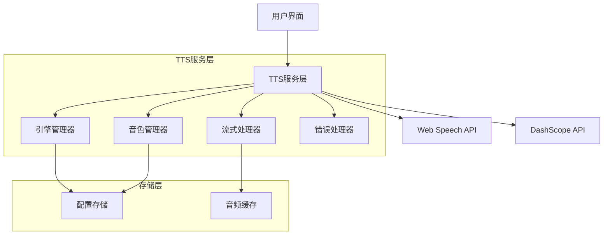

# 设计文档

## 概述

本设计文档描述了为Muse AI互动应用集成阿里云DashScope音频合成API的技术方案。该集成将为现有的Web Speech Synthesis API提供高质量的替代选项，支持多种音色、流式播放和统一的音频接口。

设计目标：
- 保持现有功能的完整性和用户体验
- 提供统一的音频合成接口，支持多种引擎
- 集成DashScope qwen3-tts-flash模型的高质量音频合成
- 支持流式和非流式播放模式
- 实现优雅的错误处理和降级机制

## 架构

### 整体架构



### 分层架构

1. **表现层 (Presentation Layer)**
   - 音频设置界面
   - 引擎选择组件
   - 音色选择组件

2. **服务层 (Service Layer)**
   - TTS统一服务接口
   - 引擎适配器
   - 音频流处理

3. **数据层 (Data Layer)**
   - 本地存储管理
   - 音频缓存管理

## 组件和接口

### 核心组件

#### 1. TTSService (TTS统一服务)

```javascript
class TTSService {
    constructor() {
        this.currentEngine = 'web-speech'; // 'web-speech' | 'dashscope'
        this.engines = new Map();
        this.config = new TTSConfig();
        this.init();
    }
    
    // 统一的音频合成接口
    async synthesize(text, options = {}) {
        const engine = this.engines.get(this.currentEngine);
        return await engine.synthesize(text, options);
    }
    
    // 切换音频引擎
    switchEngine(engineType) {
        this.currentEngine = engineType;
        this.config.save('tts_engine', engineType);
    }
    
    // 获取当前引擎支持的音色
    getAvailableVoices() {
        const engine = this.engines.get(this.currentEngine);
        return engine.getAvailableVoices();
    }
}
```

#### 2. WebSpeechEngine (Web Speech API适配器)

```javascript
class WebSpeechEngine {
    constructor() {
        this.voiceMap = {
            'yushao': { pitch: 0.7, rate: 0.8 },
            'shaonian': { pitch: 1.2, rate: 1.0 },
            'dashu': { pitch: 0.5, rate: 0.85 }
        };
    }
    
    async synthesize(text, options = {}) {
        return new Promise((resolve, reject) => {
            if (!window.speechSynthesis) {
                reject(new Error('Web Speech API not supported'));
                return;
            }
            
            const utterance = new SpeechSynthesisUtterance(text);
            const voiceConfig = this.voiceMap[options.voice] || this.voiceMap['yushao'];
            
            utterance.lang = 'zh-CN';
            utterance.pitch = voiceConfig.pitch;
            utterance.rate = voiceConfig.rate;
            
            utterance.onend = () => resolve();
            utterance.onerror = (error) => reject(error);
            
            window.speechSynthesis.speak(utterance);
        });
    }
    
    getAvailableVoices() {
        return [
            { id: 'yushao', name: '🍷 低沉御少音', description: '磁性 · 成熟' },
            { id: 'shaonian', name: '❄️ 清冷少年音', description: '清脆 · 禁欲' },
            { id: 'dashu', name: '🥃 温柔大叔音', description: '低沉 · 包容' }
        ];
    }
}
```

#### 3. DashScopeEngine (DashScope API适配器)

```javascript
class DashScopeEngine {
    constructor() {
        this.apiKey = null;
        this.baseUrl = 'https://dashscope.aliyuncs.com/api/v1';
        this.voiceMap = {
            'yushao': 'Ethan',    // 映射到DashScope的男性音色
            'shaonian': 'Cherry', // 映射到DashScope的清脆音色
            'dashu': 'Dylan'      // 映射到DashScope的成熟音色
        };
    }
    
    async synthesize(text, options = {}) {
        if (!this.apiKey) {
            throw new Error('DashScope API key not configured');
        }
        
        const voice = this.voiceMap[options.voice] || 'Cherry';
        const requestBody = {
            model: 'qwen3-tts-flash',
            input: {
                text: text
            },
            parameters: {
                voice: voice,
                language_type: options.language || 'Chinese',
                format: 'mp3',
                sample_rate: 24000
            }
        };
        
        try {
            const response = await fetch(`${this.baseUrl}/services/aigc/text2speech/speech-synthesis`, {
                method: 'POST',
                headers: {
                    'Authorization': `Bearer ${this.apiKey}`,
                    'Content-Type': 'application/json'
                },
                body: JSON.stringify(requestBody)
            });
            
            if (!response.ok) {
                throw new Error(`DashScope API error: ${response.status}`);
            }
            
            const result = await response.json();
            
            if (result.output && result.output.audio_url) {
                return await this.playAudioFromUrl(result.output.audio_url);
            } else {
                throw new Error('Invalid response from DashScope API');
            }
        } catch (error) {
            throw new Error(`DashScope synthesis failed: ${error.message}`);
        }
    }
    
    async playAudioFromUrl(audioUrl) {
        return new Promise((resolve, reject) => {
            const audio = new Audio(audioUrl);
            audio.onended = () => resolve();
            audio.onerror = (error) => reject(error);
            audio.play().catch(reject);
        });
    }
    
    getAvailableVoices() {
        return [
            { id: 'yushao', name: '🍷 低沉御少音 (Ethan)', description: '磁性 · 成熟' },
            { id: 'shaonian', name: '❄️ 清冷少年音 (Cherry)', description: '清脆 · 禁欲' },
            { id: 'dashu', name: '🥃 温柔大叔音 (Dylan)', description: '低沉 · 包容' }
        ];
    }
    
    setApiKey(apiKey) {
        this.apiKey = apiKey;
    }
}
```

#### 4. StreamingProcessor (流式处理器)

```javascript
class StreamingProcessor {
    constructor() {
        this.isStreaming = false;
        this.audioQueue = [];
        this.currentAudio = null;
    }
    
    async processStreamingAudio(audioChunks) {
        this.isStreaming = true;
        
        for (const chunk of audioChunks) {
            if (!this.isStreaming) break;
            
            const audioBlob = this.base64ToBlob(chunk);
            const audioUrl = URL.createObjectURL(audioBlob);
            
            await this.playAudioChunk(audioUrl);
            URL.revokeObjectURL(audioUrl);
        }
        
        this.isStreaming = false;
    }
    
    base64ToBlob(base64Data) {
        const byteCharacters = atob(base64Data);
        const byteNumbers = new Array(byteCharacters.length);
        
        for (let i = 0; i < byteCharacters.length; i++) {
            byteNumbers[i] = byteCharacters.charCodeAt(i);
        }
        
        const byteArray = new Uint8Array(byteNumbers);
        return new Blob([byteArray], { type: 'audio/mpeg' });
    }
    
    async playAudioChunk(audioUrl) {
        return new Promise((resolve, reject) => {
            const audio = new Audio(audioUrl);
            audio.onended = () => resolve();
            audio.onerror = (error) => reject(error);
            audio.play().catch(reject);
        });
    }
    
    stopStreaming() {
        this.isStreaming = false;
        if (this.currentAudio) {
            this.currentAudio.pause();
            this.currentAudio = null;
        }
    }
}
```

#### 5. ErrorHandler (错误处理器)

```javascript
class ErrorHandler {
    constructor(ttsService) {
        this.ttsService = ttsService;
        this.fallbackEngine = 'web-speech';
    }
    
    async handleError(error, originalRequest) {
        console.error('TTS Error:', error);
        
        // 如果DashScope失败，自动降级到Web Speech
        if (this.ttsService.currentEngine === 'dashscope') {
            console.log('Falling back to Web Speech API');
            
            const originalEngine = this.ttsService.currentEngine;
            this.ttsService.switchEngine(this.fallbackEngine);
            
            try {
                const result = await this.ttsService.synthesize(
                    originalRequest.text, 
                    originalRequest.options
                );
                
                // 显示降级通知
                this.showFallbackNotification();
                return result;
            } catch (fallbackError) {
                // 恢复原引擎设置
                this.ttsService.switchEngine(originalEngine);
                throw new Error('All TTS engines failed');
            }
        }
        
        throw error;
    }
    
    showFallbackNotification() {
        // 显示用户友好的降级通知
        const notification = document.createElement('div');
        notification.className = 'tts-fallback-notification';
        notification.innerHTML = `
            <div class="bg-yellow-500/20 border border-yellow-500/30 rounded-lg p-3 text-yellow-200 text-xs">
                <i class="fa-solid fa-exclamation-triangle mr-2"></i>
                DashScope服务暂时不可用，已切换到本地语音合成
            </div>
        `;
        
        document.body.appendChild(notification);
        setTimeout(() => notification.remove(), 5000);
    }
}
```

### 接口定义

#### TTSEngine接口

```javascript
interface TTSEngine {
    // 音频合成
    synthesize(text: string, options: SynthesisOptions): Promise<void>;
    
    // 获取支持的音色
    getAvailableVoices(): VoiceOption[];
    
    // 停止当前播放
    stop(): void;
    
    // 引擎初始化
    initialize(): Promise<void>;
}

interface SynthesisOptions {
    voice?: string;
    language?: string;
    stream?: boolean;
    speed?: number;
    pitch?: number;
}

interface VoiceOption {
    id: string;
    name: string;
    description: string;
    engine: string;
}
```

## 数据模型

### 配置数据模型

```javascript
class TTSConfig {
    constructor() {
        this.data = {
            engine: 'web-speech',           // 当前选择的引擎
            voice: 'yushao',                // 当前选择的音色
            dashscopeApiKey: null,          // DashScope API密钥
            streamingEnabled: false,        // 是否启用流式播放
            fallbackEnabled: true,          // 是否启用自动降级
            volume: 50,                     // 音量设置
            speed: 1.0,                     // 语速设置
            lastUsedEngine: 'web-speech'    // 上次使用的引擎
        };
        this.load();
    }
    
    load() {
        const saved = localStorage.getItem('muse_tts_config');
        if (saved) {
            this.data = { ...this.data, ...JSON.parse(saved) };
        }
    }
    
    save(key, value) {
        this.data[key] = value;
        localStorage.setItem('muse_tts_config', JSON.stringify(this.data));
    }
    
    get(key) {
        return this.data[key];
    }
}
```

### 音色映射数据模型

```javascript
const VOICE_MAPPINGS = {
    'web-speech': {
        'yushao': { pitch: 0.7, rate: 0.8, name: '🍷 低沉御少音' },
        'shaonian': { pitch: 1.2, rate: 1.0, name: '❄️ 清冷少年音' },
        'dashu': { pitch: 0.5, rate: 0.85, name: '🥃 温柔大叔音' }
    },
    'dashscope': {
        'yushao': { voice: 'Ethan', name: '🍷 低沉御少音 (Ethan)' },
        'shaonian': { voice: 'Cherry', name: '❄️ 清冷少年音 (Cherry)' },
        'dashu': { voice: 'Dylan', name: '🥃 温柔大叔音 (Dylan)' }
    }
};
```

## 正确性属性

*属性是一个特征或行为，应该在系统的所有有效执行中保持为真——本质上是关于系统应该做什么的正式声明。属性作为人类可读规范和机器可验证正确性保证之间的桥梁。*

基于需求分析，以下是音频合成集成功能的正确性属性：

### 属性 1: 引擎切换完整性
*对于任意* 音频引擎选择，当用户切换引擎时，系统应该保存选择到本地存储并立即应用新的引擎设置，使得后续的音频合成调用使用新引擎
**验证: 需求 1.2, 1.3, 5.2**

### 属性 2: DashScope API调用正确性
*对于任意* 文本输入，当使用DashScope引擎时，系统应该向正确的API端点发送请求，并能处理返回的音频URL和Base64格式数据
**验证: 需求 2.2, 2.3**

### 属性 3: 音色映射一致性
*对于任意* 音色选择，当使用DashScope引擎时，系统应该将用户选择的音色正确映射到对应的DashScope voice参数，并在音频合成中使用该音色
**验证: 需求 3.2, 3.3**

### 属性 4: 配置持久化
*对于任意* 有效的配置数据（引擎选择、音色设置、API密钥），系统应该能够安全存储到本地存储并在应用重启后正确恢复
**验证: 需求 1.4, 3.4, 7.3**

### 属性 5: 流式音频处理
*对于任意* 流式音频数据块序列，当启用流式模式时，系统应该能够实时播放每个音频片段而不丢失数据
**验证: 需求 4.2**

### 属性 6: 统一接口一致性
*对于任意* 音频引擎和合成参数，通过统一TTS接口调用应该产生一致的行为和回调事件，无论底层使用哪个引擎
**验证: 需求 5.1, 5.4**

### 属性 7: 参数转换正确性
*对于任意* 音频合成参数，系统应该能够在不同引擎间正确转换参数格式，使得相同的用户配置在不同引擎上产生相似的音频效果
**验证: 需求 5.3**

### 属性 8: 错误处理和降级
*对于任意* DashScope API错误或超时情况，系统应该提供适当的错误信息、重试选项或自动降级到Web Speech API，并通知用户当前使用的引擎
**验证: 需求 2.4, 4.3, 6.2, 6.4**

### 属性 9: API密钥验证
*对于任意* 输入的API密钥，系统应该验证其有效性，对于无效密钥应该显示错误并阻止使用DashScope引擎
**验证: 需求 7.2, 7.4**

### 属性 10: UI动态更新
*对于任意* 引擎选择变更，用户界面应该动态更新显示对应引擎支持的音色选项，保持UI状态与引擎状态的一致性
**验证: 需求 8.2**

## 错误处理

### 错误分类

1. **网络错误**
   - DashScope API不可达
   - 请求超时
   - 网络连接中断

2. **认证错误**
   - API密钥无效
   - API密钥过期
   - 权限不足

3. **数据错误**
   - 无效的音频格式
   - 损坏的音频数据
   - 参数验证失败

4. **系统错误**
   - Web Speech API不支持
   - 音频播放设备不可用
   - 浏览器兼容性问题

### 错误处理策略

#### 1. 分层错误处理

```javascript
class ErrorHandlingStrategy {
    // 第一层：引擎级错误处理
    handleEngineError(error, engine) {
        if (engine === 'dashscope') {
            return this.handleDashScopeError(error);
        } else {
            return this.handleWebSpeechError(error);
        }
    }
    
    // 第二层：服务级错误处理
    handleServiceError(error, context) {
        // 记录错误
        this.logError(error, context);
        
        // 尝试降级
        if (this.canFallback(context)) {
            return this.performFallback(context);
        }
        
        // 显示用户友好的错误信息
        this.showUserError(error);
        throw error;
    }
    
    // 第三层：应用级错误处理
    handleApplicationError(error) {
        // 全局错误处理
        console.error('TTS Application Error:', error);
        
        // 恢复到安全状态
        this.resetToSafeState();
    }
}
```

#### 2. 自动降级机制

```javascript
class FallbackManager {
    constructor() {
        this.fallbackChain = [
            'dashscope',
            'web-speech'
        ];
        this.currentIndex = 0;
    }
    
    async executeWithFallback(operation, context) {
        for (let i = this.currentIndex; i < this.fallbackChain.length; i++) {
            try {
                const engine = this.fallbackChain[i];
                context.engine = engine;
                
                const result = await operation(context);
                
                // 成功后更新当前索引
                this.currentIndex = i;
                return result;
                
            } catch (error) {
                console.warn(`Engine ${this.fallbackChain[i]} failed:`, error);
                
                // 如果是最后一个引擎，抛出错误
                if (i === this.fallbackChain.length - 1) {
                    throw new Error('All TTS engines failed');
                }
                
                // 继续尝试下一个引擎
                continue;
            }
        }
    }
}
```

#### 3. 用户通知系统

```javascript
class NotificationManager {
    showError(message, type = 'error') {
        const notification = this.createNotification(message, type);
        document.body.appendChild(notification);
        
        // 自动移除通知
        setTimeout(() => {
            notification.remove();
        }, 5000);
    }
    
    showFallbackNotification(fromEngine, toEngine) {
        const message = `${fromEngine}服务暂时不可用，已切换到${toEngine}`;
        this.showError(message, 'warning');
    }
    
    createNotification(message, type) {
        const div = document.createElement('div');
        div.className = `tts-notification tts-${type}`;
        div.innerHTML = `
            <div class="bg-${type === 'error' ? 'red' : 'yellow'}-500/20 border border-${type === 'error' ? 'red' : 'yellow'}-500/30 rounded-lg p-3 text-${type === 'error' ? 'red' : 'yellow'}-200 text-xs">
                <i class="fa-solid fa-${type === 'error' ? 'exclamation-circle' : 'exclamation-triangle'} mr-2"></i>
                ${message}
            </div>
        `;
        return div;
    }
}
```

## 测试策略

### 双重测试方法

本项目采用单元测试和基于属性的测试相结合的方法：

- **单元测试**: 验证特定示例、边界情况和错误条件
- **属性测试**: 通过随机输入验证通用属性，确保全面覆盖

### 单元测试重点

单元测试应专注于：
- 特定的配置示例和用例
- 组件间的集成点
- 边界情况和错误条件
- UI交互的具体场景

避免编写过多单元测试，因为基于属性的测试已经处理了大量输入覆盖。

### 基于属性的测试配置

**测试库选择**: 使用 `fast-check` 库进行JavaScript的基于属性的测试

**测试配置**:
- 每个属性测试最少运行100次迭代
- 每个测试必须引用其对应的设计文档属性
- 标签格式: **Feature: audio-synthesis-integration, Property {number}: {property_text}**

**属性测试实现要求**:
- 每个正确性属性必须由单个基于属性的测试实现
- 测试必须生成随机输入来验证属性
- 测试必须覆盖所有相关的引擎和配置组合

### 测试数据生成

```javascript
// 示例：为属性测试生成测试数据
const fc = require('fast-check');

// 生成音频引擎选择
const engineArbitrary = fc.constantFrom('web-speech', 'dashscope');

// 生成音色选择
const voiceArbitrary = fc.constantFrom('yushao', 'shaonian', 'dashu');

// 生成文本输入
const textArbitrary = fc.string({ minLength: 1, maxLength: 500 });

// 生成API密钥
const apiKeyArbitrary = fc.string({ minLength: 10, maxLength: 100 });

// 生成配置对象
const configArbitrary = fc.record({
    engine: engineArbitrary,
    voice: voiceArbitrary,
    apiKey: apiKeyArbitrary,
    streamingEnabled: fc.boolean(),
    volume: fc.integer({ min: 0, max: 100 }),
    speed: fc.float({ min: 0.5, max: 2.0 })
});
```

### 集成测试策略

1. **引擎切换测试**: 验证在不同引擎间切换时功能的连续性
2. **错误恢复测试**: 模拟各种错误情况，验证系统的恢复能力
3. **性能测试**: 验证音频合成的响应时间和资源使用
4. **兼容性测试**: 在不同浏览器和设备上验证功能

### 测试环境配置

```javascript
// 测试环境设置
const testConfig = {
    // 模拟DashScope API
    mockDashScopeApi: true,
    
    // 模拟Web Speech API
    mockWebSpeechApi: true,
    
    // 测试超时设置
    timeout: 10000,
    
    // 属性测试迭代次数
    propertyTestRuns: 100,
    
    // 错误注入配置
    errorInjection: {
        networkErrors: true,
        apiErrors: true,
        audioErrors: true
    }
};
```

这种测试策略确保了音频合成集成功能的可靠性和正确性，通过单元测试验证具体场景，通过属性测试验证通用规则，共同提供全面的测试覆盖。